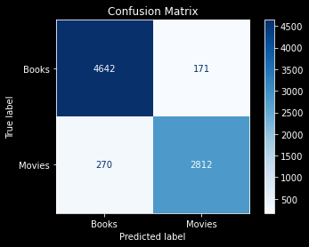

# NLP with Reddit

 ## Contents:
 
- [Problem Statement](#Problem-Statement)  
- [Data](#Data)
- [Data Analysis](#Data-Analysis)
- [Interesting Observations](#Interesting-Observations)

## Problem Statement:

This project aims to predict if a post is from 'movies' subreddit or 'books' subreddit. This is an sample of how NLP can help differnetiate topics. 
Applications include being able to sort customer commmunication to appropriate teams within a company. Ex: A bank that offers credit cards, mortgages and checking accounts can direct a customer enquiry/complaint made on their social media page to specialists in the area.

## Data
[Notebook for data download](code/download_data.ipynb)

Use Pushshift API to download posts from Reddit:

1. Books
2. Movies

## Data Analysis:
[Notebook for EDA and models](code/EDA_Models.ipynb)

**Data Cleaning**
- Only the post itself was used as our feature
- Null, [removed] and [deleted] values were dropped.
- We had nearly 24K documents  after dropping the invalid text posts.

**Modeling**

Multinomial Naive Bayes with Count vectorizor gave the best accuracy score of **94.4%** on the testing data with low variablity. The other model  tried to fit, TFID with Random forest  was overfit. Hence the model was not used. Below is the confusion matrix for the NB with CV.

    
## Interesting Observations:

- 'just', 'really', 'like','time' were the most common words across both boards
- 'know' was one of the top 10 words in Books
- 'think' was one of the top 10 words in Movies

## Next Steps:

- Try a pipeline with Count Vectorizor and then NB 
- Remove words strongly related to movies like 'movie; 'watch' from the book corpus and vice versa.

